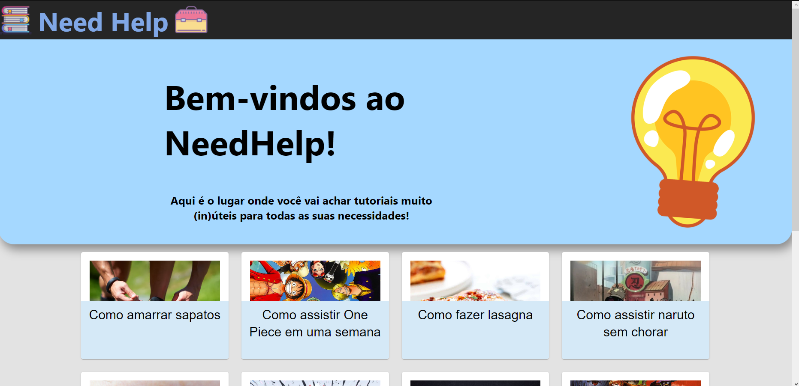
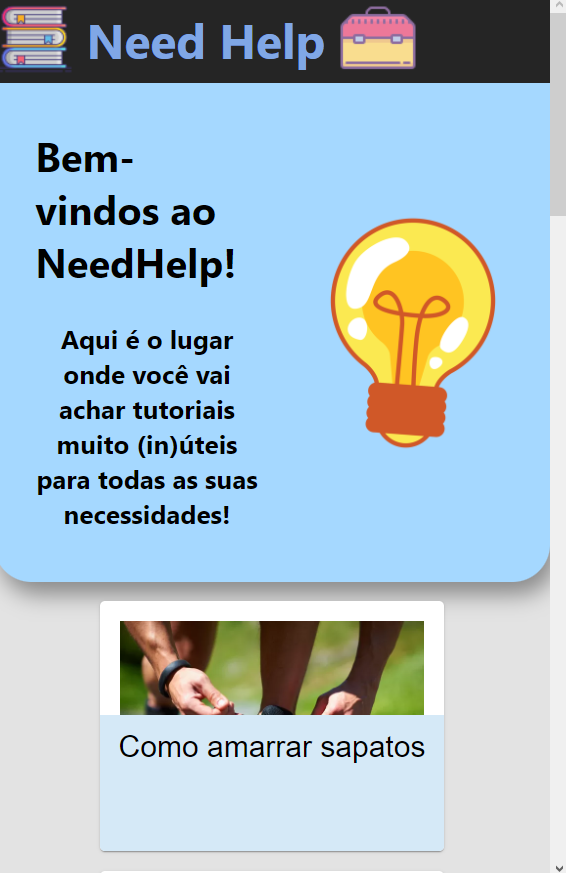
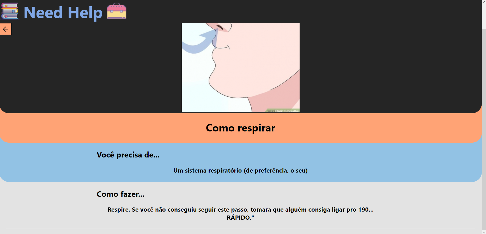
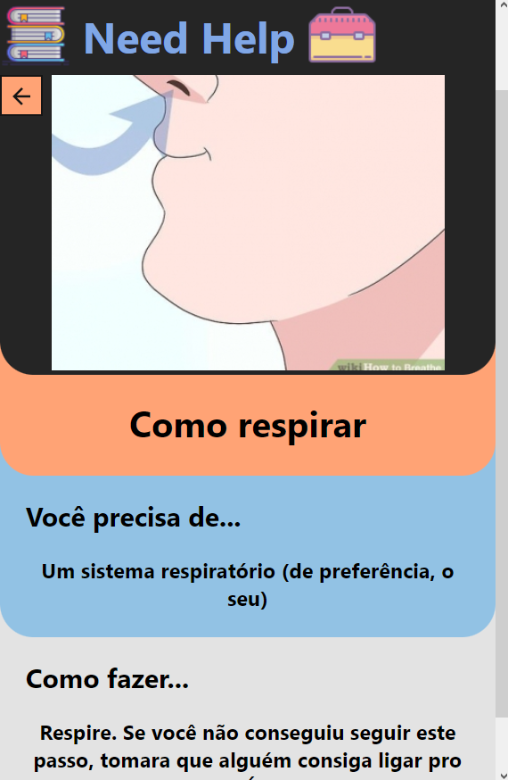

# fiap-grupoj-fase3-entrega1-React
Entrega 1 da Fase 3 do MBA de full stack development da FIAP pelo grupo J.

## Need Help, o site mais (in)útil para seus tutoriais

Com base em sites como o WikiHow e canais do youtube como o "Dad, how do I...", foi criado este protótipo: um site para criar e manter tutoriais para ações e coisas do dia a dia (neste protótipo, com cards mais voltados para situações inusitadas e um tom mais humorístico). Abaixo temos as telas da aplicação e explicações acerca de seu funcionamento.

Para esta primeira entrega, foi feita uma versão mais demonstrativa do site, com menos funcionalidades, funcionando apenas como páginas estáticas. Foram criadas duas possíveis páginas: uma página principal e uma para os tutoriais (que é populada com informações dependendo de qual tutorial pré-escrito foi clicado).

Além disso, como esta página é estática e não há inclusão de tutoriais, os que estão presentes foram pré-programados para a página, sendo que poderão ser inclusos nas entregas posteriores.

### Rodando o projeto

O projeto é feito inteiramente em ReactJS e não precisa de configurações anteriores para ser rodado. Basta ter NodeJS e as dependencias instaladas em sua máquina e rodar o comando "<i>npm start</i>".

  ##

### Home Screen

A tela principal da aplicação consiste em um <i>hub</i> com os diversos tutoriais presentes:

  

Essa tela também pode ser visualizada como quando a tela é reajustada para a situação de mobile:

  

  ##

### Tutorial Screen

Ao clicar em qualquer um dos tutoriais da tela principal, uma nova tela aparecerá, sendo populada com as informações daquele tutorial:

  

Assim como a tela principal, esta tela também pode assumir as dimensões necessárias para mobile:

  

  ##

Este é apenas o protótipo de apresentação dos tutoriais. Para verificar a API que os fornecerá, acesse [fiap-grupoj-fase3-entrega2-Spring](https://github.com/Bullamano/fiap-grupoj-fase3-entrega2-Spring).

  ##
